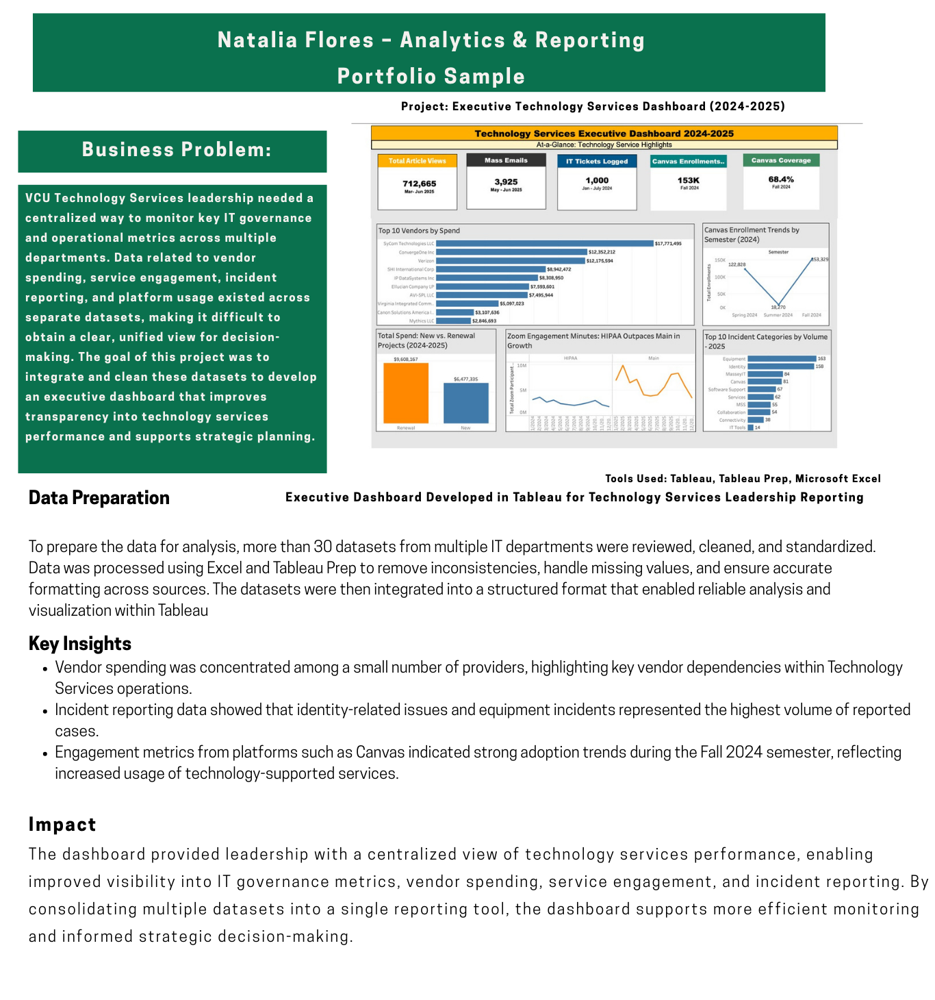

# Executive Technology Services Dashboard (2024–2025)

## Business Problem
VCU Technology Services leadership needed a centralized way to monitor key IT governance and operational metrics across multiple departments. Data related to vendor spending, service engagement, incident reporting, and platform usage existed across separate datasets, making it difficult to obtain a unified view for decision-making.

This project integrated and cleaned these datasets to develop an executive dashboard that improves transparency into technology services performance and supports strategic planning.

## Tools Used
- Tableau
- Tableau Prep
- Microsoft Excel
- Data Visualization
- Dashboard Design

## Data Preparation
To prepare the data for analysis, more than 30 datasets from multiple IT departments were reviewed, cleaned, and standardized. Data was processed using Excel and Tableau Prep to remove inconsistencies, handle missing values, and ensure accurate formatting across sources. The datasets were then integrated into a structured format that enabled reliable analysis and visualization within Tableau.

## Dashboard

## Key Insights
- Vendor spending was concentrated among a small number of providers.
- Identity-related incidents represented a large portion of reported IT issues.
- Platform engagement metrics indicated strong adoption trends during the Fall 2024 semester.

## Impact
The dashboard provided leadership with a centralized view of technology services performance, enabling improved visibility into IT governance metrics, vendor spending, service engagement, and incident reporting. By consolidating multiple datasets into a single reporting tool, the dashboard supports more efficient monitoring and informed strategic decision-making.

## Note
This project summarizes work completed during my internship with VCU Technology Services. Due to data confidentiality, the underlying datasets are not publicly shared.
